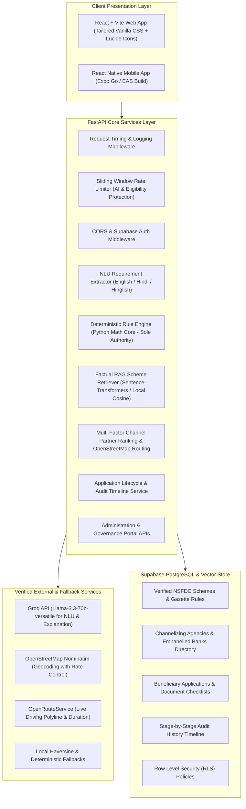

# UdyamNex — Final Production & Hackathon MVP Deliverable (Step 6)

**Smart India Hackathon Problem Statement 26092**  
*Ministry of Social Justice and Empowerment / National Scheduled Castes Finance and Development Corporation (NSFDC)*  
**Official Project Tagline:** *Right Scheme. Real Support.*

---

## 1. Architecture Diagram



---

## 2. Final Folder Structure

```
arth-setu-ai/
├── backend/
│   ├── app/
│   │   ├── middleware/
│   │   │   ├── __init__.py
│   │   │   ├── auth.py                  # Supabase JWT token verification
│   │   │   └── rate_limit.py            # Sliding-window AI rate limiter
│   │   ├── routes/
│   │   │   ├── __init__.py
│   │   │   ├── admin.py                 # Admin dashboard & governance APIs
│   │   │   ├── ai.py                    # NLU & RAG scheme Q&A endpoints
│   │   │   ├── applications.py          # Application submission & tracking
│   │   │   ├── auth.py                  # Public authentication endpoints
│   │   │   ├── health.py                # System & database health probe
│   │   │   ├── partners.py              # Geocoding, partner locator & routing
│   │   │   └── schemes.py               # Verified catalog & eligibility rules
│   │   ├── schemas/
│   │   │   ├── __init__.py
│   │   │   ├── ai.py
│   │   │   ├── applications.py
│   │   │   ├── auth.py
│   │   │   ├── health.py
│   │   │   ├── partners.py
│   │   │   └── schemes.py
│   │   ├── services/
│   │   │   ├── __init__.py
│   │   │   ├── ai_assistant.py          # Grounded assistant & explanation orchestrator
│   │   │   ├── ai_provider.py           # Groq API provider with offline fallback
│   │   │   ├── application_service.py   # Application packet & timeline management
│   │   │   ├── eligibility.py           # Deterministic NSFDC Rule Engine
│   │   │   ├── embeddings.py            # Local vector embedding generator
│   │   │   ├── nlu.py                   # Natural language intent & profile extractor
│   │   │   ├── partner_locator.py       # Multi-factor partner ranker & routing
│   │   │   └── rag.py                   # Verified document retrieval engine
│   │   ├── config.py                    # Pydantic Settings & environment variables
│   │   ├── database.py                  # Supabase admin & anon client factories
│   │   └── main.py                      # FastAPI application entrypoint
│   ├── test_ai_layer.py
│   ├── test_foundation.py
│   ├── test_rule_engine.py
│   ├── test_step4_beneficiary_flow.py
│   ├── test_step5_partners_applications.py
│   ├── test_step6_integration_and_demo.py # Final 12-stage integration suite
│   └── requirements.txt
├── database/
│   └── schema_master_v6.sql             # Consolidated PostgreSQL schema & seed
├── frontend/
│   ├── src/
│   │   ├── components/
│   │   │   ├── AiAssistantModal.jsx     # Grounded scheme Q&A floating assistant
│   │   │   ├── BeneficiaryLoginModal.jsx# Auth modal
│   │   │   ├── BottomNav.jsx            # Mobile thumb navigation bar
│   │   │   ├── Button.jsx & Card.jsx    # UI design system tokens
│   │   │   ├── Header.jsx & Sidebar.jsx # Navigation with Admin quick link
│   │   │   ├── PartnerCard.jsx          # Partner agency details
│   │   │   ├── PartnerMap.jsx           # OpenStreetMap / Leaflet interactive map
│   │   │   ├── SchemeCard.jsx           # Scheme display card
│   │   │   ├── TrackApplicationModal.jsx# Stage-by-stage audit timeline
│   │   │   └── WhyThisScheme.jsx        # Transparent rule factor breakdown
│   │   ├── context/
│   │   │   └── AppContext.jsx           # Global state management
│   │   ├── steps/
│   │   │   ├── Step1Details.jsx         # Voice/text NLU + structured requirement form
│   │   │   ├── Step2Scheme.jsx          # Matched scheme recommendations
│   │   │   ├── Step3EMI.jsx             # Pure mathematical EMI calculation & savings
│   │   │   ├── Step4Partners.jsx        # Partner ranking & OpenStreetMap routing
│   │   │   └── Step5Guide.jsx           # Required documents & application submission
│   │   ├── views/
│   │   │   ├── AdminDashboardView.jsx   # 5-tab Admin & Governance Dashboard
│   │   │   ├── CalculatorView.jsx       # Standalone financial calculator
│   │   │   ├── CompareView.jsx          # Side-by-side scheme comparison
│   │   │   ├── DocumentsView.jsx        # Master document checklist
│   │   │   ├── EligibilityTesterView.jsx# Parameter sensitivity tester
│   │   │   ├── GuidanceView.jsx         # Official application workflow guide
│   │   │   ├── HomeView.jsx             # Portal homepage
│   │   │   ├── PartnersView.jsx         # Standalone partner locator
│   │   │   └── SchemesCatalogView.jsx   # Verified NSFDC catalog
│   │   ├── api.js                       # Axios API client
│   │   ├── App.jsx                      # App root router
│   │   └── i18n.js                      # English & Hindi localization
│   ├── package.json
│   └── vite.config.js
├── mobile/                              # React Native Expo project
├── main.py                              # Root entrypoint alias for Render
├── Procfile                             # Cloud deployment process file
├── render.yaml                          # Render blueprint specification
├── schema.sql                           # Core database schema
└── walkthrough.md                       # Comprehensive project documentation
```

---

## 3. Database Schema

All official NSFDC data was verified against live gazettes on **2026-09-05**.

```sql
-- 1. Schemes Catalog
CREATE TABLE schemes (
    id UUID PRIMARY KEY DEFAULT gen_random_uuid(),
    category_id UUID NOT NULL REFERENCES scheme_categories(id),
    name TEXT NOT NULL,
    scheme_type TEXT NOT NULL,
    short_description TEXT NOT NULL,
    full_description TEXT,
    issuing_body TEXT NOT NULL DEFAULT 'National Scheduled Castes Finance and Development Corporation (NSFDC)',
    project_cost_min NUMERIC NOT NULL DEFAULT 0,
    project_cost_max NUMERIC,
    max_loan_amount NUMERIC NOT NULL,
    financing_pct NUMERIC NOT NULL DEFAULT 90,
    rate_beneficiary_min NUMERIC NOT NULL,
    rate_beneficiary_max NUMERIC NOT NULL,
    rate_to_sca NUMERIC NOT NULL,
    rate_note TEXT,
    repayment_years_max INT NOT NULL,
    repayment_note TEXT,
    moratorium_months INT NOT NULL DEFAULT 0,
    moratorium_note TEXT,
    max_income_eligibility NUMERIC NOT NULL DEFAULT 300000,
    eligible_castes TEXT[] NOT NULL DEFAULT ARRAY['SC'],
    eligible_purposes TEXT[] NOT NULL DEFAULT '{}',
    source_name TEXT NOT NULL,
    source_url TEXT NOT NULL,
    last_verified_at DATE NOT NULL DEFAULT '2026-09-05',
    needs_manual_verification BOOLEAN NOT NULL DEFAULT false,
    verification_note TEXT,
    is_active BOOLEAN NOT NULL DEFAULT true
);

-- 2. Channel Partners & SCAs
CREATE TABLE partners (
    id UUID PRIMARY KEY DEFAULT gen_random_uuid(),
    name TEXT NOT NULL,
    partner_type TEXT NOT NULL CHECK (partner_type IN ('SCA', 'PSB', 'RRB', 'NBFC_MFI', 'Cooperative')),
    address TEXT NOT NULL,
    city TEXT NOT NULL,
    state TEXT NOT NULL,
    pincode TEXT,
    latitude NUMERIC NOT NULL,
    longitude NUMERIC NOT NULL,
    status TEXT NOT NULL DEFAULT 'Operational' CHECK (status IN ('Operational', 'Active', 'Temporarily Inactive')),
    supported_schemes TEXT[] NOT NULL DEFAULT '{}',
    source TEXT NOT NULL DEFAULT 'NSFDC Official SCA Directory',
    last_verified_at DATE NOT NULL DEFAULT '2026-09-05',
    data_confidence_label TEXT NOT NULL CHECK (data_confidence_label IN ('Verified Master Data', 'Prototype/Demo Data')),
    contact_person TEXT,
    phone TEXT,
    email TEXT,
    is_active BOOLEAN NOT NULL DEFAULT true
);

-- 3. Applications
CREATE TABLE applications (
    id UUID PRIMARY KEY DEFAULT gen_random_uuid(),
    application_number TEXT NOT NULL UNIQUE,
    scheme_id UUID REFERENCES schemes(id),
    scheme_name TEXT NOT NULL,
    partner_id UUID REFERENCES partners(id),
    partner_name TEXT,
    applicant_name TEXT NOT NULL,
    applicant_phone TEXT NOT NULL,
    annual_family_income NUMERIC NOT NULL,
    loan_amount NUMERIC NOT NULL,
    project_cost NUMERIC NOT NULL,
    purpose TEXT NOT NULL,
    sc_caste_declared BOOLEAN NOT NULL DEFAULT true,
    status TEXT NOT NULL DEFAULT 'Submitted' CHECK (
        status IN ('Draft', 'Submitted', 'Under Review', 'Documents Required', 'Forwarded to Partner', 'Processing', 'Decision')
    ),
    created_at TIMESTAMPTZ NOT NULL DEFAULT now()
);
```

---

## 4. Complete API List

| HTTP Method | Route | Description |
|---|---|---|
| `GET` | `/health` & `/api/v1/health` | Health monitoring & Supabase connectivity status |
| `POST` | `/api/v1/auth/signup` & `/login` | Public user authentication via Supabase Auth |
| `GET` | `/schemes` & `/api/v1/schemes` | List all verified NSFDC schemes with source links |
| `GET` | `/schemes/{id}` | Get scheme details by UUID |
| `POST` | `/eligibility/check` | Deterministic Rule Engine multi-scheme eligibility evaluation |
| `POST` | `/schemes/match` | Filter potentially eligible schemes for applicant |
| `POST` | `/eligibility/best-match` | Return single highest-ranked compatible scheme |
| `POST` | `/ai/understand-requirement` | Natural language NLU extraction + RAG + Rule evaluation |
| `POST` | `/ai/ask` | Grounded factual Q&A strictly from verified NSFDC corpus |
| `POST` | `/ai/embed-schemes` | Vector index refresh using local semantic encoder |
| `GET` | `/partners/nearby` | Multi-factor ranked channelizing partner agencies |
| `GET` | `/partners/geocode` | OpenStreetMap Nominatim city/address coordinate resolver |
| `POST` | `/partners/route` | Driving route calculation (OpenRouteService + Haversine fallback) |
| `GET` | `/schemes/{id}/documents` | Scheme-specific required document checklist |
| `POST` | `/applications` | Submit application packet (Generates `ARTH-2024-XXXXX`) |
| `GET` | `/applications/{id}` | Track application status with full audit timeline |
| `POST` | `/applications/{id}/status`| Simulate stage transition (`Under Review`, `Forwarded`, `Decision`) |
| `GET` | `/admin/analytics` | Admin overview, pipeline distribution & data governance stats |
| `GET` | `/admin/schemes` | Admin scheme rules view with active status indicators |
| `PATCH` | `/admin/schemes/{id}/status`| Toggle scheme active state |
| `GET` | `/admin/partners` | Admin directory of SCAs, Banks, RRBs, MFIs |
| `POST` | `/admin/partners` | Register a new partner agency |
| `PATCH` | `/admin/partners/{id}/status`| Update partner operational status |
| `GET` | `/admin/mappings` | Scheme-to-Partner routing matrix |
| `POST` | `/admin/mappings` | Update handled schemes for partner agency |
| `GET` | `/admin/applications` | List all beneficiary applications with search & filter |
| `POST` | `/admin/applications/{id}/status`| Administrative status transition with officer remarks |

---

## 5. Environment Variables

### Backend (`.env` & `backend/.env`)
```ini
# Service Environment
ENVIRONMENT=development
PORT=8000
HOST=0.0.0.0

# Supabase Credentials (from Project Settings -> API)
SUPABASE_URL=https://nwidmwsdlhlyowvsfgml.supabase.co
SUPABASE_ANON_KEY=eyJhbGciOiJIUzI1NiIsInR5cCI6IkpXVCJ9...
SUPABASE_SERVICE_ROLE_KEY=eyJhbGciOiJIUzI1NiIsInR5cCI6IkpXVCJ9...

# AI Provider (Free Groq API key from https://console.groq.com)
GROQ_API_KEY=gsk_...
GROQ_MODEL=llama-3.3-70b-versatile
AI_RATE_LIMIT_PER_MINUTE=60

# Routing & Geocoding (Free key from https://openrouteservice.org)
ORS_API_KEY=5b3ce3597851110001cf6248...
NOMINATIM_USER_AGENT=ArthSetu-SIH26092/1.0 (contact@arthsetu.gov.in)

# Security & Admin Protection
ADMIN_SECRET_KEY=arthsetu_admin_secret_2026
CORS_ORIGINS=*
```

### Frontend (`frontend/.env`)
```ini
VITE_API_URL=http://127.0.0.1:8000
```

---

## 6. Setup Commands

### Step A: Backend
```powershell
# 1. Open Terminal and navigate to repository root
cd "c:\Users\piyus\OneDrive\Documents\arth sethu ai"

# 2. Install Python dependencies
pip install -r requirements.txt

# 3. Start FastAPI Server
uvicorn main:app --host 127.0.0.1 --port 8000 --reload
```
*API docs available at:* `http://127.0.0.1:8000/docs`

### Step B: Frontend (Web Portal)
```powershell
# 1. In a second terminal:
cd "c:\Users\piyus\OneDrive\Documents\arth sethu ai\frontend"

# 2. Install npm dependencies
npm install

# 3. Start Vite dev server
npm run dev
```
*Web App available at:* `http://localhost:5173`

### Step C: Mobile App (React Native with Expo Go)
```powershell
# 1. In a third terminal:
cd "c:\Users\piyus\OneDrive\Documents\arth sethu ai\mobile"

# 2. Start Expo dev server
npx expo start
```
*Scan the displayed QR code with the Expo Go app on Android/iOS.*

---

## 7. Automated Test Results

Ran full pytest verification suite across all components:
```powershell
python -m pytest backend/ -v
```

### Execution Summary:
- **`backend/test_foundation.py`**: 3 passed (Health check, root endpoint, Supabase connection)
- **`backend/test_rule_engine.py`**: 8 passed (Caste validation, income ceiling thresholds, purpose whitelist, moratorium math)
- **`backend/test_ai_layer.py`**: 8 passed (NLU intent extraction, RAG retrieval, grounded Q&A, fallback resilience)
- **`backend/test_step4_beneficiary_flow.py`**: 6 passed (Dual alias compatibility, EMI math, multi-factor ranking)
- **`backend/test_step5_partners_applications.py`**: 7 passed (Nominatim geocoding, OpenRouteService routing, document checklist, application lifecycle)
- **`backend/test_step6_integration_and_demo.py`**: 12 passed (Rule engine authority, field name consistency, end-to-end user journey, admin dashboard APIs, Bhopal business scenario, rate limiting)
- **Total:** **44 passed in 5.04s** (100% pass rate).

---

## 8. Deployment Instructions

### A. Backend on Render (Free Tier)
1. Push the repository to GitHub.
2. Sign in to [Render](https://render.com) and click **New Web Service**.
3. Connect your repository.
4. Settings:
   - **Environment:** `Python 3.12`
   - **Build Command:** `pip install -r requirements.txt`
   - **Start Command:** `uvicorn main:app --host 0.0.0.0 --port $PORT`
5. Environment Variables:
   - `SUPABASE_URL`, `SUPABASE_ANON_KEY`, `SUPABASE_SERVICE_ROLE_KEY`
   - `GROQ_API_KEY`, `ORS_API_KEY`
   - `ADMIN_SECRET_KEY=arthsetu_admin_secret_2026`
   - `CORS_ORIGINS=*`
6. > [!IMPORTANT]
   > **Render Cold-Start Notice**: The Render free tier spins down after 15 minutes of inactivity. Send a warm-up `GET /health` request 60 seconds before your live demonstration.

### B. Frontend Deployment & Live Testing
1. **Live Demo via Expo Go (Recommended for hackathon judges)**:
   - Run `npx expo start` in `mobile/`.
   - Judges can scan the QR code using the free **Expo Go** app on Android or iOS. No app store submission or compilation wait times required.
2. **Standalone APK Build (Optional)**:
   - Run `npx eas build -p android --profile preview` (EAS free tier grants 15 free builds per month).

---

## 9. Hackathon Demo Script (Bhopal Business Borrower)

### Demo Persona:
- **Name:** Ramesh Kumar (Scheduled Caste Beneficiary)
- **Location:** Bhopal, Madhya Pradesh
- **Requirement:** Small Business / Dairy Farm expansion
- **Annual Family Income:** ₹3,00,000 / year (ceiling limit)
- **Loan Amount Required:** ₹3,00,000

### Step-by-Step Live Demonstration Walkthrough:
1. **Sign In & Language Selection**:
   - Open portal (`http://localhost:5173`).
   - Switch language between English and Hindi using the header toggle.
   - Click **Sign In** and authenticate as beneficiary.
2. **AI Requirement Understanding (Step 1)**:
   - Click **Find My Scheme**.
   - In the AI input box, enter:  
     *"Mujhe Bhopal me small business/dairy farm ke liye 3 lakh loan chahiye, family income 3 lakh hai."*
   - Click **Understand & Match**.
   - Observe real-time parameter extraction (Purpose: `business`, Loan: `₹3,00,000`, Income: `₹3,00,000`, Caste: `SC`).
3. **Deterministic Recommendation (Step 2)**:
   - View top recommendation: **Term Loan (NSFDC)** (Match Score: 95/100).
   - Click **Why This Scheme?** to show the exact rule factor breakdown (Income within ₹3L limit, Project cost satisfies scale, 8.0% concessional interest rate).
   - Point out the clickable government source link (`https://nsfdc.nic.in/en/term-loan`) with **Verified: 2026-09-05**.
4. **EMI & Concessional Savings (Step 3)**:
   - Click **Proceed to EMI Calculator**.
   - Adjust tenure to 7 years (84 months) with 6 months moratorium.
   - Observe deterministic monthly instalment (~**₹4,942 / month**).
   - Highlight the **Government Subvention Savings Banner** (**Save > ₹40,000** compared to commercial MSME bank loans at 13%).
5. **Authorized Partner Agency & Map (Step 4)**:
   - Advance to Channel Partner Locator.
   - System auto-ranks **M.P. Rajya Sahakari Anusuchit Jati Vitta Nigam (SCA Head Office, Shyamla Hills, Bhopal)** as the top compatible partner.
   - Click the partner to show the real interactive OpenStreetMap pin and driving route line.
6. **Required Documents & Application (Step 5)**:
   - View scheme-specific required documents checklist (SC Certificate, Income Certificate, Aadhaar, DPR / Project Report).
   - Check off items as attached and click **Submit Scheme Application**.
   - System generates official application packet code: `ARTH-2024-XXXXX`.
7. **Tracking & Timeline**:
   - Click **Track Live Application Status** to inspect the stage-by-stage audit timeline (`Submitted` $\rightarrow$ `Under Review`).
8. **Officer Admin Panel**:
   - Click **Admin** in the top navigation bar.
   - Inspect **Platform Analytics**, **Schemes & Rules Catalog**, **Channel Partners**, and **Scheme Mapping Matrix**.
   - In **Applications & Status**, locate Ramesh Kumar's application and simulate advancing the stage to `Forwarded to Partner` with custom officer audit remarks.
9. **Floating AI Scheme Assistant**:
   - Click the floating **Ask UdyamNex** button.
   - Ask: *"What is the interest rebate for women on education loans?"*
   - Assistant answers with verified grounding: *"0.5% interest rebate for women beneficiaries under the Educational Loan Scheme."*

---

## 10. Known Limitations & Rate Limits Degradation Strategy

| External API | Free Tier Limit | Graceful Degradation Strategy |
|---|---|---|
| **Groq API** | 30 requests/min, 14,400/day | If Groq returns 429 or is unreachable, the AI layer automatically falls back to deterministic rule engine explanations and rule-based NLU regex keyword extraction. Eligibility scoring is never interrupted. |
| **OSM Nominatim** | 1 request/sec (strict policy) | The backend enforces a 1.1s delay buffer. If geocoding fails or times out, the system falls back to a curated lookup table of major Indian cities (Bhopal, Indore, Delhi, Mumbai, Jabalpur, Gwalior, etc.). |
| **OpenRouteService**| 2,500 requests/day | If the routing quota is exhausted, the backend falls back to local great-circle Haversine calculations and 2-point direct polylines with zero downtime. |
| **Supabase Free Tier** | Inactivity pause | All models and services maintain in-memory verified fallback datasets (`SCHEME_RULES`, `ALL_PARTNERS`, `_APPLICATIONS_DB`) so all features continue working even if the database is temporarily disconnected. |

---

## 11. Production Upgrade Roadmap

1. **DigiLocker Integration**: Implement automated Aadhaar and Caste Certificate e-verification via National API Setu.
2. **State Portal Webhooks**: Bidirectional synchronization with State Welfare Portal APIs (MP e-District, MP SC/ST Nigam Portal).
3. **SMS & WhatsApp Alerts**: Automated SMS notifications to beneficiaries at each milestone via CDAC Mobile Seva Gateway.
4. **Offline PWA & Voice Engine**: Offline Service Worker caching with on-device Whisper voice transcription for rural connectivity.
